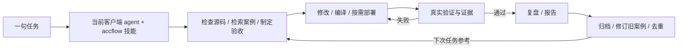

# accflow：海思加速器持续演进工作流

把本工程加载为 Codex、Claude Code 或 OpenCode 的 `accflow` 技能，直接向当前 agent 提任务。**agent 负责规划、开发和调测；框架负责状态、证据、验收门槛以及案例库的修订与去重。** Claude/OpenCode 的主流程不再调用另一个 Codex 模型。

[图解原理与完整用法](docs/workflow-guide.md) · [环境 JSON 模板](examples/environment.json) · [agent 内部执行协议](docs/agent-protocol.md)

## 一次安装，直接提任务

```bash
python3 workflow.py install --client all
```

使用已有 `config.local.json`，或根据环境模板填写仓库路径、SSH 主机、芯片/内核、设备及 BMC 信息。构建和测试命令由 agent 根据具体任务生成，不要求用户预先编写。

- Codex：`$accflow 请完成……，验证后给出报告并复盘归档。`
- Claude Code：`/accflow 请完成……，验证后给出报告并复盘归档。`
- OpenCode：`加载 accflow skill，请完成……，验证后给出报告并复盘归档。`

更新本工程后再执行 install 同步技能。`--client codex|claude|opencode` 可单独安装；`--target /path/to/project` 可安装为项目级技能；`install --check` 检查是否为当前版本。需要时重开客户端会话发现新技能。



## 什么才算完成

每个任务冻结源提交与环境，使用隔离副本，记录命令、输出和哈希。失败必须定位后有界重试；有部署时先回滚。缺少验收、测试后源码或产物变化、日志被修改，均不能结项。纯分析可说明原因后跳过构建，不再触发不必要的 `profile.artifacts` 要求。

案例库保留根因、修复、失败尝试、适用环境及证据。新的任务可以修订旧结论，保存 before/after 历史，而不是不断追加重复条目。这是经验与流程的持续演进，不是模型权重训练。

原生 `start` 只创建会话并返回 next，**由加载技能的 agent 继续执行**，不是脱离客户端的后台服务。暂停后可让任意已安装客户端继续相同任务 ID。宿主权限、无法恢复的硬件故障和模型能力仍会限制结果；框架不会把阻塞伪装成成功。

## 已完成的真实任务

[UADK 组装 LZ4 性能分析与修复报告](reports/lz4-study/REPORT.md) 保留 423 次严格绑核基线；[双设备带宽与窗口优化报告](reports/lz4-study/CEILING.md) 追加官方 `uadk_tool` 实测约 15.974 GB/s、组装 LZ4 约 15.880 GB/s、单核至 64 核曲线及压缩率取舍。旧 14–15 核交叉点限定为单设备策略，双设备 8 KiB 窗口为 52–56 核。[复现工具说明](docs/controlled-benchmark.md) 和 [其他环境填写模板](docs/lz4-environment.example.json) 随报告提供。LZ4 案例涵盖 6 类问题，修订两条旧案例并保留历史；本次真实任务通过不代表三个 agent 客户端的加载集成均已验证。

## 开发与验证

```bash
python3 -m unittest discover -s tests -v
python3 workflow.py demo
```

新测试覆盖原生会话、真实子进程执行、失败修复、证据防篡改、过期验收、历史修订和三端安装器。demo 是旧批处理的本地模拟，不代表硬件通过。详细测试和客户端验证边界见 [本轮验证记录](reports/workflow-validation/REPORT.md)。

`start --headless` 和 `new/run` 保留旧 Runner，要求完整的逐阶段命令 profile，再启动配置的 Codex CLI/command agent；它是高级批处理选项，不是三端技能的默认路径。实例地址只在本机配置和实验原始证据中保留，其他环境通过模板接入。
