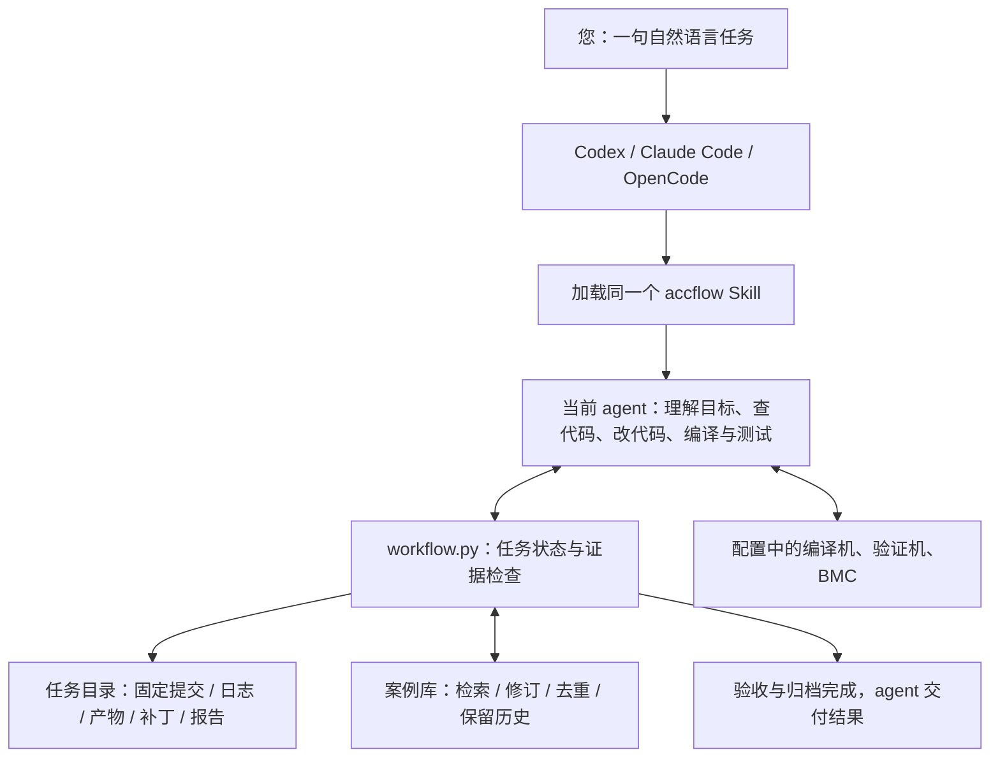
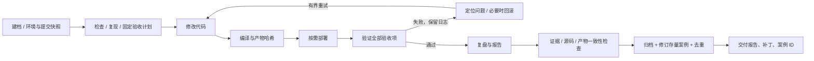
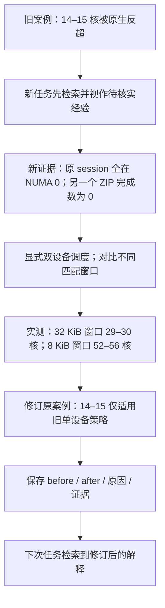

# 从一句任务到验证和案例演进

## 它是什么

accflow 是加载到编程 agent 的技能，加上一套本地任务与案例管理程序。**负责思考和实际开发的是您正在使用的 Codex、Claude Code 或 OpenCode；负责持久化任务、检查证据和维护历史的是本工程。** 不需要再购买或启动另一个模型。

先前版本不完整：技能只转发 `new/run`，依赖预先填写逐阶段命令，Claude/OpenCode 也会落到 Codex 子进程。`profile.artifacts` 报错正是这个设计错位。现在默认 `start` 为原生 agent 会话：任务命令与验收计划由当前 agent 检查代码后生成，环境模板只填写可复用事实。旧批处理作为 `--headless` 保留。



Skill 是 agent 的执行说明；Python 是可验证的记录与检查机制。两者缺一不可。单独在终端运行 native `start` 只会建档并返回下一步，不会在后台凭空继续开发。将 Skill 加载到 agent 后，agent 会读取 next 并连续执行，这才是本工程的主要使用方式。

## 一次安装

在 acc_work_flow_codex 目录运行一次：

```bash
python3 workflow.py install --client all
```

| 客户端 | 安装位置 | 开始任务 |
|---|---|---|
| Codex | `~/.agents/skills/accflow` | `$accflow 完成下面任务：……` |
| Claude Code | `~/.claude/skills/accflow` | `/accflow 完成下面任务：……` |
| OpenCode | `~/.config/opencode/skills/accflow` | `加载 accflow skill，完成下面任务：……` |

不需要同时安装三个客户端。可用 `--client codex` 等单独安装；`--target /path/to/project` 安装到项目级技能目录。安装器不会覆盖其他来源的同名技能；更新本仓库后再执行 install 即同步技能。Skill 内保存源码位置，项目从其他目录打开也能找到本工程。源码目录搬家后重新安装。

本机已配置的环境放在被 Git 忽略的 `config.local.json`。它包含当前用户提供的编译机、验证机、设备 NUMA 映射和 BMC 恢复信息，不包含密码/token。新环境用 [JSON 模板](../examples/environment.json)，填写路径、SSH 别名、芯片、内核、设备和恢复方式；不需要用户先写任务的 build/test 脚本。

配置路径可直接告诉 agent：

```text
使用 accflow，环境是 /absolute/path/lab-b.json。
目标仓库是 uadk 和 kernel。请完成以下任务：……
```

技能未出现在列表时，重开客户端会话，执行 `python3 workflow.py install --check` 确认三个目标的 current 状态。Codex/Claude 可显式调用，OpenCode 通过自身 skill 工具发现。本机未安装 OpenCode 可执行程序，因此 OpenCode 的真实模型会话仍需要在装有该客户端的机器上验证；目录和包装入口按官方规范实现并已做安装测试。

## 每次只需描述目标

```text
使用 accflow，参考 lz4_uadk 的 lz77_only 组装方法，对比原生 LZ4。
使用配置中的验证环境，同等物理核资源从单核测到多核，
覆盖压缩率、CPU 时间、双设备计数、块大小和匹配窗口。
定位瓶颈并优化，给出图表和报告，最后复盘归档并修订旧案例。
```

agent 会自行选择源码、检索旧案例、读取 INSTALL、探测环境并形成验收计划。缺少凭据、硬件不可恢复或权限不允许时才停在具体阻塞上；已有会话授权应复用。Skill 不能绕过宿主客户端的审批策略。上传 GitHub 等动作仍依您明确授权执行。



功能开发和修复都包含开发中遇到的其他问题。纯分析可以解释原因后跳过 change/build/deploy，而不能用虚假 so 满足构建门槛。模型的 `ready` 不足以完成任务：检查点、每一项验收、当前源码及产物哈希和真实执行日志都必须满足。

## 如何自演进

这里的“演进”是可追溯的经验修订，不是训练模型权重，也不是让 agent 任意修改自己的权限。



原始测量不删除。完全相同的根因、方案与环境合并；相似但不等同的条目形成复核候选；跨硬件/内核的结论先作为 proposal，避免错误覆盖。撤销结论使用 retire 保留记录。框架本身的规则改进通过正常代码修改与回归测试进入 Git，不进行无限自改写。

## 任务中断以后

告诉任意已安装客户端：

```text
使用 accflow 继续 TASK-xxxxxxxxxxxx，读取持久化状态和证据，
确认远程执行状态后从检查点继续，完成验证和归档。
```

三端读取同一个本地目录，所以案例共享。跨机器需共享/迁移工作流任务目录与环境；不能仅把 task ID 传到另一台没有证据的机器。任务中的长命令可以超时，重启设备不会自动证明任务成功。agent 使用环境中的 BMC 方式恢复并记录，确实需要人工时报告精确原因。

## 能力与边界

| 能力 | 当前实现 |
|---|---|
| 三端加载同一技能 | 一键用户级/项目级安装；绝对路径定位，不依赖当前目录 |
| Claude/OpenCode 不依赖 Codex | 原生路径由当前客户端执行，没有第二个 LLM 子进程 |
| 自动规划具体命令 | 由当前 agent 检查任务、源码和环境后生成固定验收计划 |
| 验证与自动返工 | 命令证据、失败保留、轮次预算、回滚门槛、源码变更使验证过期 |
| 复盘与存量维护 | 结构化 finding/revisions、环境匹配、历史事件和去重 |
| 无客户端也长期后台工作 | 不是原生 Skill 的能力；旧 headless 需完整适配器和已登录 CLI |
| 任意复杂任务必定成功 | 不保证；缺权限、硬件故障或验收无法满足会留下阻塞证据 |
| 本轮硬件性能结果 | 已在真实 Kunpeng 运行，见性能报告；不能将它等同三端全部端到端已测 |

开发者协议和全部内部命令见 [agent-protocol.md](agent-protocol.md)。正常使用不需要用户阅读协议或手动执行每个阶段。

官方加载规则核对： [Codex Skills](https://developers.openai.com/codex/skills/)、[Claude Code Skills](https://code.claude.com/docs/en/skills)、[OpenCode Skills](https://opencode.ai/docs/skills/)。
