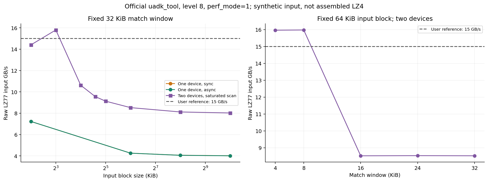
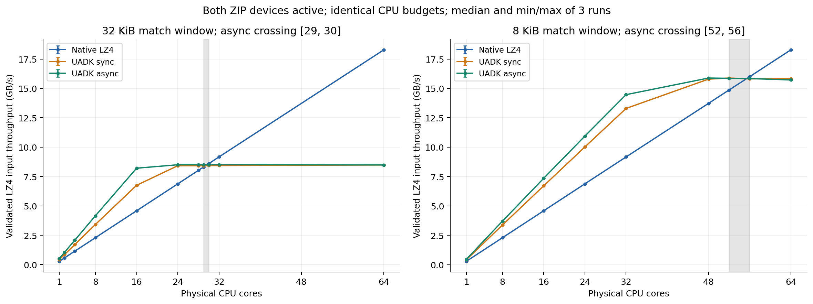
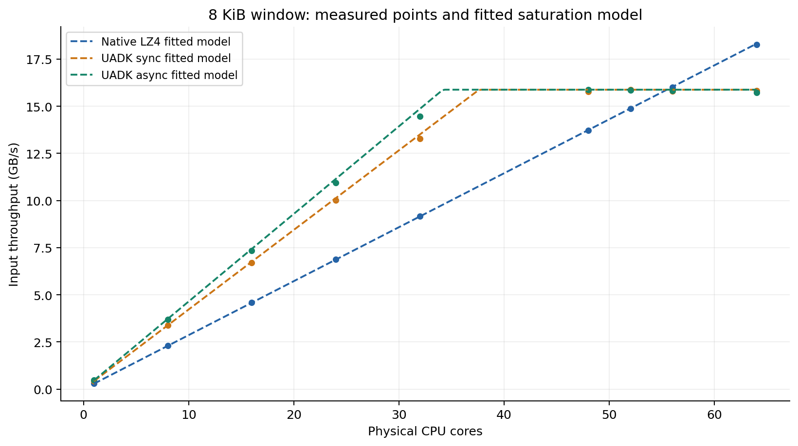
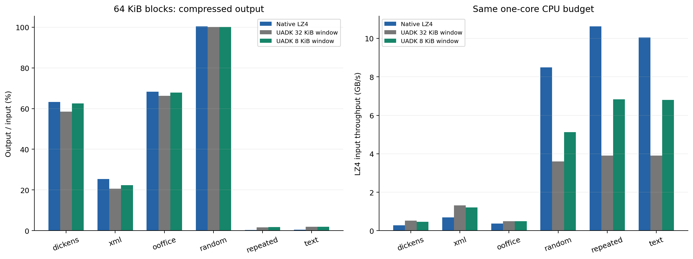

# 双 ZIP 的 LZ77 带宽上限、LZ4 优化与压缩率

日期：2026-09-07。真实硬件实测，单位均为十进制 GB/s；输入块大小和匹配窗口使用 KiB。ZIP 模块参数 `perf_mode=1, uacce_mode=1, pf_q_num=64`。本轮完成 80 个官方工具实验、248 个独立基准实验，其中 240 个是经原生解码验证的 LZ4 运行，8 个仅测原始 LZ77。另有一个深度 32 失败点，单独保留且不参加统计。此前 423 个基线样本不改写。

## 主要结果

**通过官方 `uadk_tool benchmark` 实测，双设备 `lz77_only` 在 64 KiB 输入块、8 KiB 匹配窗口、等级 8 时达到 15.974 GB/s（三次中位数，范围 15.971–15.977）。** 单设备约 7.987 GB/s。这里测的是原始 LZ77 输入吞吐，不包含 LZ4 组装。用户提出的 7.5 × 2 G/s 按十进制 GB/s 作为参考线；未获得对应规格文档的单位、时钟及窗口条件，不能把测得超过 15 GB/s 解释为超出硬件规格。

**实际组装 LZ4 也已提升：Dickens、64 KiB 块、双设备、8 KiB 窗口、48 物理核时，异步中位数 15.880 GB/s，范围 15.876–15.908。** 原生 LZ4 在相同 CPU 集合约 13.724 GB/s，硬件路径约快 16%。压缩输出均经过独立的原生 LZ4 block 解码和逐字节检查。

这包含两项不同的改进：显式 NUMA 会话选择使实际工作分配到两个 ZIP，将原 32 KiB 窗口的平台从约 4.25 提高到约 8.5 GB/s，压缩率基本不变；8 KiB 匹配窗口进一步提高硬件带宽，但会改变压缩率及 CPU 组装成本。默认窗口仍保留 32 KiB，8 KiB 是显式可选策略。

## 官方工具实测

| 输入块 | 匹配窗口 | 单设备同步 GB/s | 双设备同步 GB/s | 重复 |
|---:|---:|---:|---:|---:|
| 4 KiB | 32 KiB | 7.144 | 14.311 | 3 × 5 秒 |
| 64 KiB | 32 KiB | 4.263 | 8.523 | 3 × 5 秒 |
| 64 KiB | 4 KiB | 7.982 | 15.964 | 3 × 5 秒 |
| 64 KiB | 8 KiB | 7.987 | 15.974 | 3 × 5 秒 |

单设备列为 NUMA 0，NUMA 1 的结果相近。异步在 64 KiB/32 KiB 条件下双设备中位数 8.519 GB/s，在 4 KiB/32 KiB 条件下为 14.297 GB/s。最终 8 KiB 窗口带宽采用同步数据，避免将官方异步工具共享输出缓冲区且回调未检查请求状态的实现当作正确性证明。



扫点揭示两个参数需要分开记录：保持 32 KiB 窗口，8 KiB 输入块测到双设备约 15.797 GB/s，但 16/24/32 KiB 块约为 10.620/9.556/9.129，64 KiB 约 8.52，1 MiB 约 8.02；保持 64 KiB 块，仅把窗口枚举从 4（32 KiB）改成 1（8 KiB），双设备从约 8.53 提升至约 15.98。中间块大小是单次筛选点，关键窗口配置才进行了三次重复。

官方工具命令示例（单个设备）：

```bash
export LD_LIBRARY_PATH=/tmp/accflow-lz4-unified/.libs:/usr/lib64
numactl --physcpubind=0,2,4,6,8,10,12,14 --membind=0 \
  /tmp/accflow-lz4-unified/uadk_tool benchmark \
  --alg lz77_only --mode sva --opt 0 --sync \
  --pktlen 65536 --seconds 5 --thread 8 --ctxnum 8 \
  --device hisi_zip-1 --prefetch --complevel 8 --winsize 1
```

双设备同时运行两个进程，另一个使用 CPU `64,66,...,78`、`--membind=1 --device hisi_zip-0`。两个进程相邻启动，各自运行同样时长，聚合其工具吞吐；总 CPU 预算是 16 个物理核。每个实验 JSON 保存两个命令、实际亲和性采样及前后设备计数。最终关键点另有 15 秒同步运行。没有使用 `--init2` 默认分配来猜测两个设备是否均有流量。

注意 `--winsize 0/1/2/3/4` 分别代表 4/8/16/24/32 KiB；不是直接填写字节数。最初省略 `--complevel` 时，默认等级 0 被驱动拒绝，系统日志报 `comp_lv(0) is unsupport`，工具却返回 0 并打印零吞吐。现将非零吞吐、正确设备完成计数和进程返回码同时作为采样门槛。

工具与 `libwd/libwd_comp/libwd_crypto/libhisi_zip` 使用匹配构建并隔离加载，没有替换系统库。官方源码与编译机副本 SHA-256 一致。工具输出 KiB/s，按 `KiB/s × 1024 / 1e9` 换算。工具计时分母使用配置秒数，异步还可能计入排空尾部；因此关键上限以同步重复实验为主。

官方输入是每线程一个重复使用的热缓冲区，前约 70% 为地址种子生成的伪随机数据，余下为零；并非 Silesia。该构建未启用 FSE，相关函数是占位实现，所以输出 `compress data rate: 100%` 不代表 LZ4 压缩率。本报告不把工具输出文件当作标准压缩文件，也不把硬件完成计数单独当作内容正确性证明。

## 没达到带宽的原因

### 已证实：只让一个设备工作

UADK RR 调度器默认在创建 session 时读取当前 NUMA 节点。原封装传入空 `sched_param`，基准主线程在 NUMA 0 创建所有 session。因此即使两设备都有队列，所有压缩仍进入 NUMA 0 的设备。直接计数显示另一设备为零。

新增 `lz4_uadk_create_ctx_on_node` 和 `lz4_uadk_async_create_on_node`，把节点显式传给 UADK；基准逐个在所属 CPU 创建会话，并由工作线程本地首次触碰输入。优化后，两设备完成数均增长且近似均衡。例如 8 KiB 窗口 48 核一次运行，两个 PCI 功能分别完成 247536 和 247416 个描述符。计数含预热，不能直接等同计时请求数。

反向回归把创建线程固定在 NUMA 0，却指定 NUMA 1，随后反向测试；每次同步、异步请求只进入指定设备，其他设备计数为零。它验证的是会话选择，不只是 CPU 放置相关性。

### 已证实：32 KiB 匹配窗口对应较低吞吐

默认封装把 `WD_COMP_WS_32K` 写死，原 `params.window_size` 没有实际控制 session。现在同步 API 使用该字段；异步新增 `lz4_uadk_async_create_config(depth, threads, node, window_kb)`。支持 4/8/16/24/32 KiB，0 保持 32 KiB 默认，非法值拒绝。

独立 raw 诊断使用相同 Dickens 输入、相同 32 核和块边界，省略 CPU LZ4 组装：32 KiB 窗口约 8.448 GB/s，8 KiB 窗口约 15.733 GB/s。官方工具亦出现同样变化。因此 8.5 GB/s 平台的主要限制不在 LZ4 组装。窗口缩小改变了硬件匹配工作及输出序列，能够提高该负载下硬件侧有效带宽。

尚未测得 ZIP 的真实工作时钟和内部每字节周期，debugfs 工作周期寄存器为零，直接只读 MMIO 映射失败；故不把“窗口变大导致几次内部扫描”等具体微架构解释写成已证实事实。也不能用集成设备的 PCIe 显示速率推断其片内互连带宽。

### 已证实：增加队列并不能消除该平台

64 KiB/32 KiB 官方单设备同步从 4 到 8/16 线程仍约 4.26 GB/s；异步从 1 到 8 提交线程、增加 poll 队列仍约 4.26。独立封装深度 1/4/8/16 的双设备高并发结果也在约 8.5 GB/s。继续堆线程/队列无法替代设备选择和窗口配置。

8 KiB 窗口下，32 核组装 LZ4 异步约 14.466 GB/s，而 raw 同核约 15.733，说明 CPU 提交、轮询及组装开始成为剩余差距的重要组成；48 核组装达到约 15.880，接近官方平台。本轮没有进一步做指令级归因，不把全部差距归到某一 memcpy 或编码循环。

## 核数、公平性与交叉点



每个物理核使用一个 SMT 线程，工作线程固定单核，软硬件使用同一 CPU 集合。核数大于 1 时尽量均分两个 NUMA 节点，封装轮询不增加额外线程。所有有效运行还检查全部进程线程没有超出集合。这是调度亲和性控制，不是整机独占或 IRQ 隔离。

32 KiB 窗口下，双设备异步 16 核约 8.207 GB/s、24–64 核约 8.5 GB/s；原生软件在 **29 与 30 核之间**反超。旧单设备的 14–15 核结论已在原报告及案例库中限定适用范围。

8 KiB 窗口结果（三次中位数）：

| 物理核数 | 原生 LZ4 GB/s | UADK 同步 GB/s | UADK 异步 GB/s | 异步/软件 |
|---:|---:|---:|---:|---:|
| 1 | 0.286 | 0.422 | 0.465 | 1.62x |
| 8 | 2.292 | 3.374 | 3.702 | 1.62x |
| 16 | 4.583 | 6.705 | 7.348 | 1.60x |
| 24 | 6.877 | 10.017 | 10.940 | 1.59x |
| 32 | 9.166 | 13.295 | 14.466 | 1.58x |
| 48 | 13.724 | 15.787 | 15.880 | 1.16x |
| 52 | 14.866 | 15.878 | 15.854 | 1.07x |
| 56 | 15.998 | 15.812 | 15.836 | 0.99x |
| 64 | 18.283 | 15.822 | 15.717 | 0.86x |

本次将反超定位在 **52–56 核区间**，没有测试 53/54/55 核，不声称精确整数交叉点。阴影和误差条为采样区间、最小最大值，不是统计置信区间。



虚线是按单核实测和实测平台拟合的解释模型，点为真实测量；不是独立预测。它体现用户预期的随 CPU 数增加，硬件先有优势、饱和后被软件反超的形态。硬件卸载仍消耗 CPU：8 KiB 窗口下 Dickens 单核约 0.465 GB/s，比 32 KiB 的约 0.521 更低，因此不能由平台翻倍推导单核也翻倍。

## 压缩率与选择建议



下表为 64 KiB 块的输出/输入比例，越小越好；UADK 使用异步数据：

| 输入 | 原生 LZ4 | UADK 32 KiB 窗口 | UADK 8 KiB 窗口 |
|---|---:|---:|---:|
| Dickens | 63.26% | 58.50% | 62.46% |
| XML | 25.33% | 20.71% | 约 22.42% |
| Ooffice | 68.32% | 66.23% | 约 67.91% |
| 随机字节 | 100.39% | 100.018% | 100.018% |
| 重复单字节 | 0.407% | 约 1.70% | 约 1.73% |

Dickens 从 32 KiB 改 8 KiB 后，输出增加约 6.8%，但仍比原生少约 1.3%；压缩倍数约为 1.709x → 1.601x，原生约 1.581x。空间节省率约 41.50% → 37.54%，原生约 36.74%。比率从累计整数输入/输出字节计算，是计时循环处理输入的加权结果，不是单次全文件归档大小。

UADK 比例包含每块 12 字节私有封装，原生为裸 block，64 KiB 时该差约 0.0183 个百分点。不可压缩数据原样存储不算软件压缩回退。当前封装仍不是标准 LZ4F，已验证的是其内部 block 可被原生解码。

CPU 很有限且希望更小输出时，Dickens/XML 优先考虑 32 KiB 窗口；CPU 可提供约 24–52 核、目标是更高总吞吐时，8 KiB 窗口更合适。随机及强重复输入上，虽然小窗口提高了 UADK 吞吐，原生软件仍更快，不能强制卸载全部输入。应用可依据内容、CPU 配额及输出大小需求选策略；本轮提供显式 API，没有实现未经验证的自动策略切换。

## 验证与剩余问题

- 当前源码对应 [窗口优化完整补丁](patches/lz4-uadk-window-full.patch)，基于上游 `4603e887faea33e64a888d559b23f7836ed72296`，反向检查通过。同步/异步默认保持 32 KiB；新增五档窗口及默认值均通过原生解码，非法节点和窗口被拒绝。相关 [NUMA 0](raw/diagnostics/window-node0-test.json)、[NUMA 1](raw/diagnostics/window-node1-test.json) 回归保留了设备计数。
- 最新二进制的 [12 项功能测试](raw/diagnostics/window-functional.log) 和 [64 请求异步回归](raw/diagnostics/window-async-regression.log) 通过。独立基准所有 LZ4 运行均在计时前遍历输入块、原生解码并逐字节比较；不声称计时期间逐请求回解。
- 32 核、8 KiB 窗口、深度 8 的 30 秒压力点通过，约 14.490 GB/s，两设备完成数 3323024 和 3335624，包含预热。[压力点](raw/window/window-146.json)。48 核约 15.9 GB/s 为短时重复实测，未做该核数下长期稳定性保证。
- 32 KiB 窗口追加深度 32 的 `optimized-103` 失败，提交返回 -62，内核 11:46:25 报 `qm_db_timeout`，随后 `Controller reset complete`。保留 [失败记录](raw/optimized/optimized-103.json) 与 [内核证据](raw/diagnostics/lz4-depth32-kernel.log)。深度 1/4/8/16 通过；不把降低深度描述为已修复内核根因。
- [最终内核日志](raw/diagnostics/lz4-ceiling-kernel-final.log) 中未见 11:46:25 之后新增 ZIP 超时，结束时两设备可用队列均为 64。[环境与二进制身份](raw/diagnostics/lz4-ceiling-environment-final.json)。`perf_mode` 参数读为 1，未直接验证 MMIO 中该位；设备实测带宽比未经验证的寄存器推断更可信。
- 一次官方确认批次曾与功能回归重叠，因此整批不纳入统计，保留 [历史归档](raw/diagnostics/official-confirm-before-serialization.tgz)；报告只使用随后串行重测的 `raw/official-confirm`。初次采样器在 numactl 执行绑核之前观察到宽 affinity，已修正为在 exec 到实际 benchmark 后才检查；没有放宽运行中线程的亲和性门槛。

## 证据与复现

官方： [全部 80 点](official-all.csv)、[关键配置中位数及范围](official-summary.csv)、原始 [粗扫](raw/official/summary.json)、[细扫](raw/official-fine/summary.json)、[最终重复](raw/official-confirm/summary.json)。每个 JSON 旁有独立输出日志和命令。

封装： [全部追加样本](optimization-all.csv)、[重复点统计](optimization-summary.csv)、[窗口压缩率](window-compression.csv)、[机器可读结论](ceiling-statistics.json)。原始 [NUMA 优化](raw/optimized/summary.json)、[窗口优化](raw/window/summary.json)。`raw` 模式标为 `RAW_NOT_LZ4`，不参与 LZ4 压缩率结论。

复现脚本为 `scripts/lz4_ceiling_matrix.py` 和 `scripts/lz4_ceiling_report.py`，参数及换机注意事项见 [测量说明](../../docs/controlled-benchmark.md)。源码和编译机校验值分别在 [本地](raw/diagnostics/window-local-identities.txt) 与 [编译机](raw/diagnostics/window-build-identities.txt)。案例归档同时修订旧的单设备交叉点解释，保留事件历史，不把几百个测量点逐一创建成案例。
