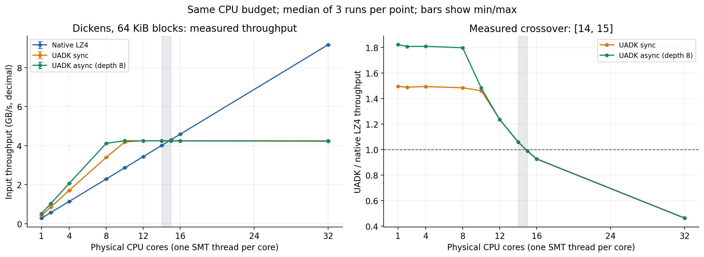
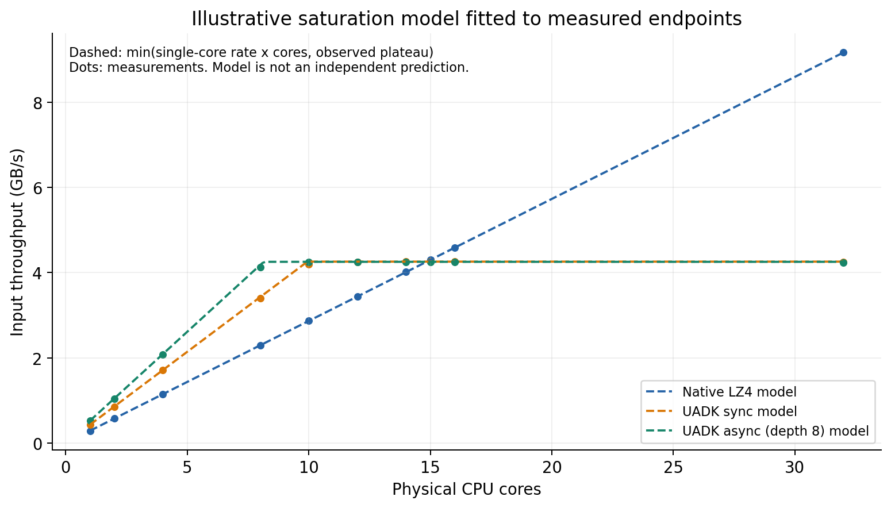
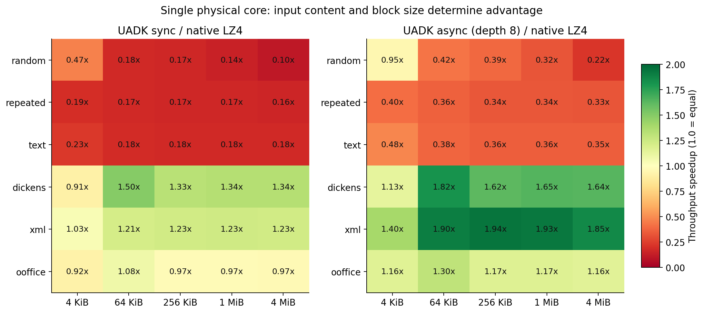
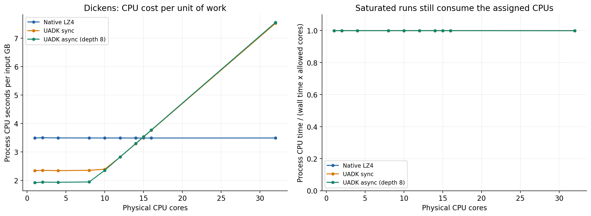
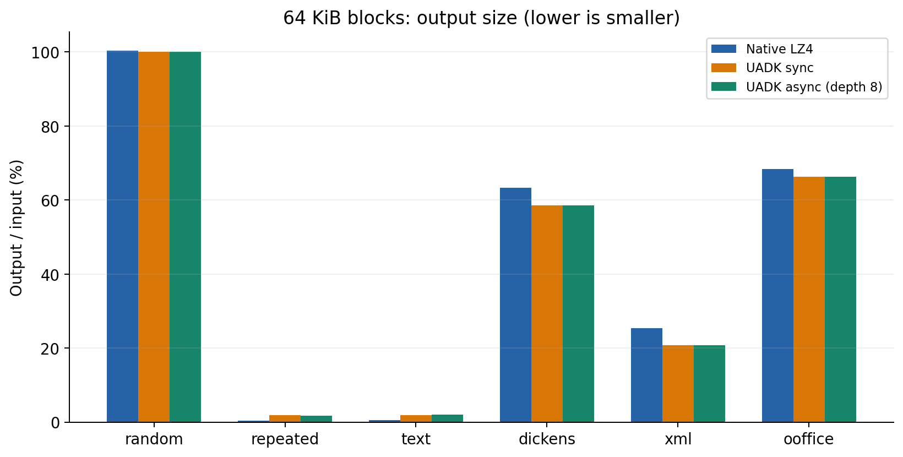
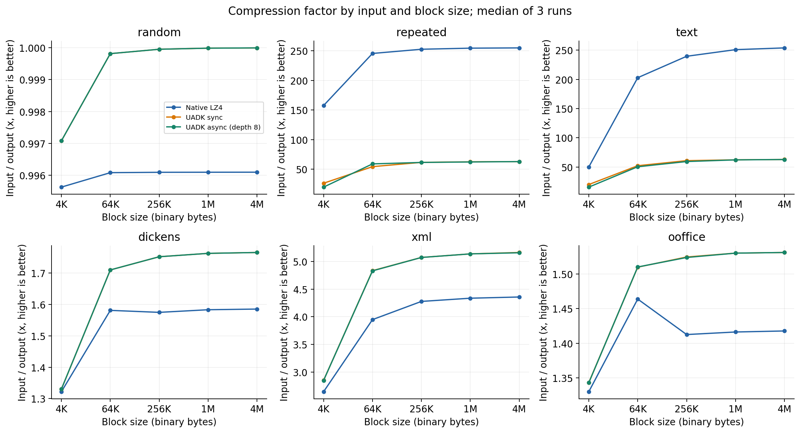
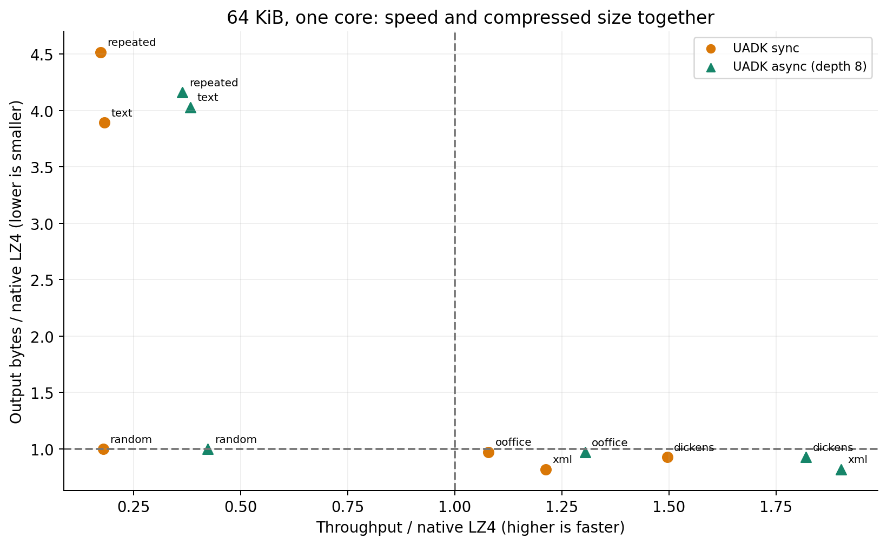

# UADK lz77_only 组装 LZ4：修复与受控性能分析

日期：2026-09-07。本文结果来自真实 Kunpeng 验证机。最初基线矩阵共 423 次运行，141 个配置点，每点重复 3 次；追加双设备、窗口优化及官方 `uadk_tool` 测试详见 [带宽上限与优化报告](CEILING.md)。基线证据保留，旧结论的适用范围按追加证据修订。

**最新结论：此前约 4.25 GB/s 的平台实际仅使用一个 ZIP 设备。** 显式 NUMA 会话选择后，32 KiB 匹配窗口下双设备约 8.5 GB/s；改为 8 KiB 窗口后，组装 LZ4 约 15.9 GB/s，原生 LZ4 反超区间移至 52–56 物理核。官方原始 `lz77_only` 的双设备实测约 15.97 GB/s。这些是不同窗口条件下的实测，不应混为同一压缩率下的提升。

## 结论

**基线单设备策略下找到了硬件优势场景和性能交叉点。** Dickens 文本、64 KiB 块、严格单物理核时，原生 LZ4 为 **286.4 MB/s**，UADK 同步为 **427.9 MB/s（1.49 倍）**，UADK 异步为 **521.9 MB/s（1.82 倍）**。两种 UADK 路径在 **14 与 15 个物理核之间**被原生 LZ4 反超；该区间仅适用于旧的单设备会话策略，不是双设备极限。

这不是“硬件完全不消耗 CPU”的证明。硬件承担 LZ77 匹配，CPU 仍负责提交、轮询、三元组筛选、LZ4 编码及内存复制。单核 Dickens 上，异步每处理 1 GB 消耗约 **1.91 CPU 秒**，原生 LZ4 约 **3.49 CPU 秒**，CPU 时间成本下降约 **45%**；但持续满负荷运行时，三种实现仍接近占满分配的 CPU。

优势与数据内容相关。XML、Dickens、Ooffice 上异步有优势；随机数据、重复单字节、固定句子循环组成的合成文本上原生 LZ4 更快。本报告中的 `text` 特指这种高度重复的合成输入，不能当作一般真实文本。

## 基线核数扩展与交叉点

下表为中位数，十进制 MB/s。14 核的异步约 4246.7 MB/s，软件 4013.6 MB/s；15 核的异步约 4243.3 MB/s，软件 4299.8 MB/s。三次重复在这两个点上都保持相同的优劣方向。

| 物理核数 | 原生 LZ4 | UADK 同步 | UADK 异步 | 异步/软件 |
|---:|---:|---:|---:|---:|
| 1 | 286.4 | 427.9 | 521.9 | 1.82x |
| 2 | 571.6 | 850.8 | 1033.2 | 1.81x |
| 4 | 1145.5 | 1710.4 | 2071.5 | 1.81x |
| 8 | 2292.3 | 3401.3 | 4120.1 | 1.80x |
| 10 | 2865.6 | 4186.5 | 4251.5 | 1.48x |
| 12 | 3438.5 | 4251.6 | 4245.2 | 1.23x |
| 14 | 4013.6 | 4255.9 | 4246.7 | 1.06x |
| 15 | 4299.8 | 4255.0 | 4243.3 | 0.99x |
| 16 | 4586.6 | 4253.4 | 4242.5 | 0.92x |
| 32 | 9170.0 | 4248.5 | 4229.7 | 0.46x |

异步到 8 核已接近本配置约 4.25 GB/s 的平台；同步约到 10 核接近平台。软件可继续随物理核数扩展。平台反映本次设备、NUMA、队列和封装组合的有效上限，不能直接解释为所有 ZIP 设备聚合的规格极限。

虚线是利用实测单核吞吐与平台值拟合的解释模型：`T_SW(N)=N*T_SW(1)`，`T_HW(N)=min(N*T_HW(1), 平台值)`。它展示用户预期的“先占优、后被反超”形态；它不是独立预测或额外测量。约 `4250/286.4=14.8` 核与实测 14 至 15 核区间一致。

## 优势场景与块大小

单核 64 KiB 的独立筛选矩阵如下，与扩展矩阵分开运行，轻微数值差异正常：

| 输入 | 原生 LZ4 MB/s | UADK 同步 MB/s | UADK 异步 MB/s | 异步/软件 |
|---|---:|---:|---:|---:|
| 随机字节 | 8501.4 | 1526.9 | 3604.3 | 0.42x |
| 重复单字节 | 10721.3 | 1859.5 | 3906.7 | 0.36x |
| 固定句子循环 | 10202.7 | 1854.8 | 3903.8 | 0.38x |
| Dickens | 286.1 | 428.1 | 520.8 | 1.82x |
| XML | 695.0 | 842.7 | 1321.4 | 1.90x |
| Ooffice | 378.1 | 407.8 | 493.0 | 1.30x |

较复杂的可压缩真实数据更值得考虑硬件：软件需要进行更多匹配查找，硬件匹配收益足以覆盖提交和组装成本。对于极易匹配的长重复串或不易匹配的随机数据，原生 LZ4 自身有很快的处理路径，卸载成本反而突出。这一原因分析与测量一致，但未做指令级采样归因。

4 KiB 小块对同步提交开销敏感：Dickens 同步只有软件的约 0.91 倍，异步仍为 1.13 倍。64 KiB 是本实验 Dickens 的最佳相对加速点；增大到 256 KiB 至 4 MiB，异步绝对吞吐约 535 至 543 MB/s，软件也加快，相对收益约 1.62 至 1.65 倍。XML 在 256 KiB 附近异步达到约 1.94 倍。

适用建议：对真实文本/结构化内容，CPU 配额有限且可批量提交时，优先评估 64 至 256 KiB、异步深度 8。对随机、强重复内容或 CPU 充足而 ZIP 已饱和的负载，优先软件。这里没有覆盖网络、磁盘、延迟分位数、能耗、其他业务并跑、不同异步深度或全部 NUMA 放置组合，不能据此推出这些维度的优势。

## CPU 成本与压缩比例

单核 Dickens：软件 3.49、同步 2.34、异步 1.91 CPU 秒/GB。硬件饱和后继续增加轮询线程，会增加每 GB 的 CPU 成本；“更多线程”不是硬件路径的无限扩展方法。测量中的 CPU 时间包含用户态和系统态，使用整个进程时钟核对线程 CPU 时间。

64 KiB Dickens 的输出/输入比例：原生约 63.26%，UADK 约 58.50%；XML 约 25.32% 对 20.71%；Ooffice 约 68.32% 对 66.23%。相反，重复单字节的软件输出约 0.41%，UADK 约 1.7% 至 1.8%。不能只看压缩吞吐而忽略存储/传输字节数。

原生使用 `LZ4_compress_default`；UADK 使用原项目的 LZ77 level 8、32 KiB 窗口及组装规则，并非相同的搜索策略。本次未比较 LZ4HC。两条路径处理相同原始输入，但不要求产生相同压缩字节流。

这里明确三个指标：输出/输入比例越小越好；压缩倍数为输入/输出、越大越好；空间节省率为 `1-输出/输入`。全部从累计整数字节数计算，包含私有封装的结果与扣除每块 12 字节后的 payload 结果分别保留在 [压缩率对照 CSV](compression-comparison.csv)。它们是计时循环中实际处理字节的比例，不是每个文件仅压缩一次的精确归档大小。

完整数表见 [64 KiB 压缩率表](compression-table.md)。8 KiB 窗口下新增结果见 [窗口取舍](CEILING.md#压缩率与选择建议)：不能只凭吞吐提高判定所有工作负载都应采用小窗口。

## 定位与修复

1. **UADK 运行库混用及初始化崩溃**：统一 `libwd/libwd_comp/libhisi_zip`，通过 `LD_LIBRARY_PATH` 和 `.libs/uadk/` 隔离加载；默认线程数为 0 时也提供有效 NUMA bitmap。同步和异步共用初始化入口，分配两种队列，允许两种 API 顺序使用。
2. **异步误报和缓冲区生命周期**：原测试把单次非阻塞 poll 的 0 当失败；改为有截止时间的重试。请求改用 slot 自有输入副本；输出空间不足时返回 `-ENOSPC`，保留完成请求以供重试，成功消费后再推进序号；修正累计输出计数。
3. **原生 LZ4 解码失败**：原组装器未落实块尾约束，自带解码器容忍了这一点。末尾匹配改为字面量，保留安全尾部；修正 offset 校验重复累计 pending 字节的问题，并校验源数据范围。硬件请求错误不再伪装为压缩成功。
4. **绑核不公平**：旧基准清理函数调用 `numa_run_on_node()` 扩大 CPU 集合，软件继承扩大后的 affinity。独立程序每线程固定单核并检查整个进程的线程集合。旧 `thread_scaling_retest.txt` 只保留为反例。
5. **异步背压**：初版独立程序把短暂 `-EBUSY/-EAGAIN` 当致命错误。改为 poll 回收已完成请求后重试，计时包含这些成本；旧失败记录保留在 `raw/scaling-before-backpressure.*`。

修复源码已写入本地 `lz4_uadk/src/lz4_uadk.c` 与 `test/test_lz4_uadk.c`，并在编译机重建后部署测试。[基线完整补丁](patches/lz4-uadk-fixes.patch) 基于上游提交 `4603e887faea33e64a888d559b23f7836ed72296`；对应最初 423 次测试。追加 NUMA 和窗口配置后的当前源码对应 [新版完整补丁](patches/lz4-uadk-window-full.patch)，同样基于该上游提交且反向检查通过，两份完整补丁不要叠加应用。

## 验证证据与边界

- 原功能套件的全部 12 项测试通过，包含 9 个 Silesia 文件及约 117 MB 合并文件：[日志](raw/functional-retest.log)。原有大文件测试仅检查长度，不把它当作独立正确性证明。
- 新增异步回归通过 64 个请求，覆盖输入覆写、顺序、队列满/复用、ENOSPC 重试、两种初始化顺序和原生解码：[日志](raw/async-regression.log)。
- 423 次最终性能运行全部完成；每次预热遍历全部输入，用原生块解码器还原并逐字节比较，然后才计时。运行前后检查每个工作线程 affinity，并检查进程全部线程的允许 CPU 集合。它验证全部输入块的正确性，不代表逐次验证每个计时请求的输出。
- 早先失败矩阵在 10:32:36 中止，内核 10:32:38 出现可恢复 `qm_db_timeout` 并报告 `Controller reset complete`。最终矩阵运行区间为 10:34:58 至 10:44:54，未再产生此类告警。历史队列超时与进程退出的因果关系尚未证明，不能声称修复了内核硬件故障根因；后续压力检查日志单独保留。
- 原项目输出使用 `magic + block header + payload + end marker` 的私有封装，缺少标准 LZ4F 帧头。**修复后的 block 可以由原生 LZ4 解码，但整个封装仍不是标准 LZ4F 文件。** 本报告按块压缩任务比较；UADK 输出量包含每块 12 字节私有封装，软件输出为原生 block。
- 本次修复和验证覆盖正常完成、背压及输出重试；不声明取消尚未完成的 DMA 请求、跨线程同时创建/销毁全局运行时等未测生命周期场景已经完善。
- 补充 32 核异步持续 30 秒压力通过：约 127.8 GB、1,950,352 个请求、4260.3 MB/s；两设备可用队列恢复为 64，无新增 ZIP 超时。[压力日志](raw/stress-32core.log)、[内核收尾日志](raw/kernel-final.log)。短时通过不等于长期稳定性证明。

## 环境与复现

验证机：Kunpeng 920 7270Z，2.7 GHz，64 物理核/128 逻辑 CPU，两个 NUMA 节点；内核 `7.0.0+ #15`。CPU 来自 NUMA 0，使用 `0,2,...,62`，另一 SMT 线程不参与压缩工作。此为调度亲和性限制，不是整机独占、CPU quota 或 IRQ 隔离。

ZIP 参数：`uacce_mode=1, perf_mode=1, pf_q_num=64`；两个 ZIP UACCE 设备，NUMA 分别为 1 和 0。运行库来自统一的 UADK 2.11.0 构建，LZ4 为目标机原生 1.9.4。编译机 GCC 10.3.1，优化为 `-O3`。环境、运行库映射和产物 SHA-256 见 [environment.json](raw/environment.json)。

UADK 本地源提交为 `f1d6df2b5fdb82ec61b46980502634bd18db8d55`；编译机为无 `.git` 的源拷贝，已核对 `wd_comp.c` 与 `wd_util.c` 的 SHA-256 和本地一致。实际使用的二进制身份以环境快照中的 SHA-256 为准，未把版本号相同当作 ABI 一致的充分证据。

计时范围为内存驻留热数据压缩：不包括磁盘读取、初始化、预热和解压验证。每组软件/硬件使用同一文件、相同块边界、相同核数；工作线程为每核一个。异步深度每线程 8，轮询不增加额外线程。主矩阵每点 2 秒，场景筛选每点 1 秒，均重复 3 次；误差条为重复的最小值至最大值，不是置信区间。

工具与环境填写方式见 [测量说明](../../docs/controlled-benchmark.md) 和 [环境模板](../../docs/lz4-environment.example.json)。最终原始数据：[scaling](raw/scaling.csv)、[crossing](raw/crossing.csv)、[screen](raw/screen.csv)；每条具体命令和环境变量均在同名 `.log` 中。输入 SHA-256 保存在 `raw/*-inputs.json`。

汇总数据：[全部 423 行](lz4-controlled.csv)、[中位数和范围](summary.csv)、[机器可读结论](statistics.json)。所有图提供同名 PNG 与 PDF。重新生成图表：`python3 scripts/lz4_report.py --report-dir reports/lz4-study`。

## 复盘归档

通过工程现有 `Library.archive()` 和 `maintain()` 初次归档四个可复用案例；本轮追加 NUMA 会话分配、匹配窗口取舍两例，并对原绑核方法和异步稳定性案例提交 amend 修订，两例版本均从 1 升至 2。历史事件和旧推断保留，当前有效案例共 6 个，无重复合并候选。性能采样保留在证据文件，不逐点堆积成案例。结构化复盘见 [review.json](review.json)，案例库见 [library.json](../../cases/library.json)。

本次由当前 agent 完成真实编译、部署、验证与归档，使用了工程案例 API 和新增复现工具；不将这一任务通过扩大宣称为 Codex/Claude/OpenCode 三端插件加载、任意任务规划或全自动恢复机制均已通过验证。
