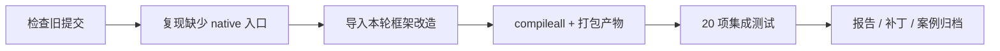

# 当前 agent 工作流改造与验证记录

日期：2026-09-07。对应实现：`accflow/session.py`、`accflow/install.py`、原生 CLI、三端通用 accflow Skill。

## 解决的实际问题

旧版将技能调用转交给预配置的 Runner。用户需要先提供每个阶段的命令和 artifacts，Claude/OpenCode 也可能转而启动 Codex。它没有实现用户期待的“当前 agent 接到一句任务后，自己执行到验收与归档”。

现在三端安装同一份技能，当前客户端 agent 使用自己的工具检查、开发、调测和复盘。Python 保存任务状态、固定提交与验收计划、记录命令和日志、检查源码/产物/证据哈希，并维护案例。分析任务允许说明原因后省略构建。用户不需要编写阶段命令或手动提交来驱动执行。

## 真实验证路径

原生任务 `TASK-070836b344b9` 使用工程的隔离 Git 副本执行：

这是当前 Codex agent 驱动的真实本地流程；不是把旧 demo 的成功当作新流程验证，也不是一次新的 LZ4 性能测试。任务配置保留了创建时的实验室信息，实际验收范围明确限定为本机框架代码和临时夹具，不声明该实验室硬件通过。

| 验证 | 结果及证据 |
|---|---|
| 旧提交基线 | 明确输出 `NATIVE_ENTRY_MISSING`，返回 1；[原日志](evidence/0002-baseline-1.log) |
| 构建 | 隔离副本 `compileall` 成功，生成 `native-workflow.tgz` 并捕获 SHA-256 |
| 原生集成测试 | 20/20 通过，12.490 秒；[原日志](evidence/0005-verify-1.log) |
| 旧批处理兼容性 | `workflow.py demo` 第一次验证失败，第二轮修复完成；这是本地模拟，非硬件验证 |
| 插件/技能结构 | 官方 plugin validator 与 skill validator 均通过 |
| 三端安装状态 | 用户级目录均已安装，`install --check` 三项 current=true |
| 三端包装入口 | 安装到临时项目后从无关工作目录调用，包含空格路径，三个入口均通过 |

产物 SHA-256：`a7129484a775ddcc5cdc7c12c690db941ce9b97073e40c9cccc972d90347ad03`。

测试覆盖无 artifact 的纯分析、固定验收项、真实子进程、失败记录与重试、缺失验收阻止归档、源码变更使验证过期、构建后改源码必须重建、日志和产物篡改检测、中断恢复、部分部署失败后的真实回滚、旧案例修订保留 before/after，以及三端安装与目录定位。哈希用于检测意外不一致，不是对拥有本地写权限的 agent 的安全隔离。

## 未通过的硬件探测单独保留

任务 `TASK-4f2c90a8a5c7` 的框架测试通过，但硬件探测返回 1，任务状态为 blocked。验证机重启后内核变为 `7.0.0+ #2`，ZIP 编号为 `hisi_zip-2/3`，perf_mode 为 0，旧 `/tmp/accflow-lz4-unified` 产物消失。详见 [失败现场日志](evidence/hardware-preflight-failed.log)。

这项检查只证明环境与旧测试前提不同，不能证明加速器存在故障，也不推翻先前环境下的性能测量。本轮用户要求的是框架改造，因此没有为此重新加载驱动、恢复 perf_mode 或重跑带宽测试；阻塞任务没有被归档为硬件成功。本机未来任务使用的环境事实已更新，原任务的冻结配置保留。

## 客户端验证边界

当前 Codex agent 已通过本工程的原生接口走完本地开发验证流程。Codex、Claude Code 和 OpenCode 的技能目录、安装器和包装脚本已核对官方文档并测试。未宣称三种客户端都完成了独立模型会话的端到端验证：本机没有 OpenCode 可执行程序，Claude Code 没有启动独立模型会话。安装新技能后可能需要重开客户端会话。

原生 CLI 不是独立守护进程。持续执行依赖加载技能的当前 agent；宿主审批、连接故障、模型能力仍可能形成真实阻塞。框架能检查验收证据是否齐全一致，不能自动判断任意报告的自然语言结论是否科学；性能数据与报告语义仍需 agent 审核。

用户入口、环境模板与原理图见 [工作流使用指南](../../docs/workflow-guide.md)。本轮 LZ4 修复已推送为 [efae81d](https://github.com/IAMHCHCH/lz4_uadk/commit/efae81d213190fbf5d47f8119a34438d26751550)。
